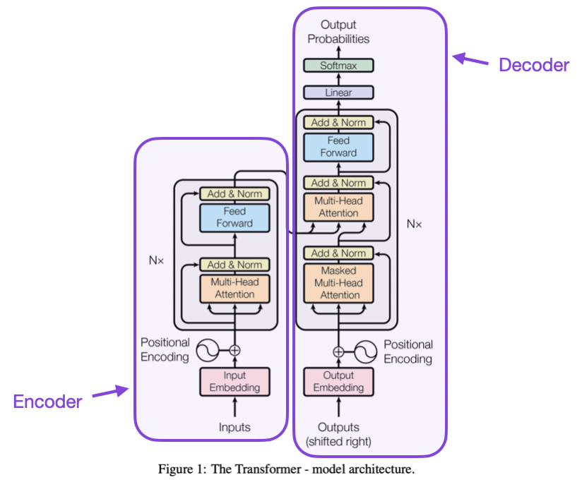

# GPT_40k

  

## Introduction
Nowadays we have LLms that can do a lot of tasks for us, they can generate images, text, videos and more. But how does a LLm work? Most LLMs are made of transformers, so better understand how as large language model works, we first have to understand how a transformer works. 

And in order to do that, I followed this wonderful [Github Repo](https://github.com/karpathy/ng-video-lecture) by Andrej Karpathy. I practically ran the code with minimal changes, later i will explain why, since i did not created the code the least i could do was to deeply understand the code and its minutiae of the implementation 

## Dataset
The trainning dataset is composed of 7 books of the 40k universe, the books are the **Eisenhorn trilogy**, the **Night Lords trilogy** and **Know no fear**. By merging these books we got a corpus of more than 4 million characters and 97 unique characters, the OpenWebText dataset used to train GPT-2 has a size of 41GB, so we have a very, very small dataset. 

## Tokenizer
In previous work i created a tokenizer based on the 40k universe, this project you can find it [HERE](https://github.com/gabe1007/40k-Tokenizer). I had the objective of using the tokenizer to tokenize the input before feeding it to the model, however i ran into a few issues.

* I was not being able to use the the GPU's full processing capacity. I was using as T4 GPU card. 
* Even decreasing the size of the model, trainning was taking to long. 
* In order to speed up trainning i rented a cluster of GPUs however the trainning time did not improve.

The next step was to analyse the model to see what was happening, then i notice that the tokenizer i created was too slow. In order to fix that, i decided to use the [tiktoken library](https://github.com/openai/tiktoken), i was able to increase the speed of the process, however as my dataset was small and i was using a robust tokenizer, my model was overfitting to fast. I came to the conclusion that the vocabulary size tiktoken produced could play a role. A tokenizer with a larger vocabulary (more that 50000 tokens, mine has 1000) means more unique tokens, which increases the input dimensionality for the transformer. Since the dataset is small, this higher dimensionality might make overfitting more likely.

Because of this i decided to use a character level tokenizer, where instead of more than 50000 tokens there were only 95, this tokenizer was also implemented in this [Github Repo](https://github.com/karpathy/ng-video-lecture), after this i realized why Andrej did it, if he mentioned the reason in the YouTube video i did not pay attention to. After changing the tokenizer, i was able to properly use the GPU and i did not need to use a paid one, i used a kaggle notebook to train the model

## Trainning

